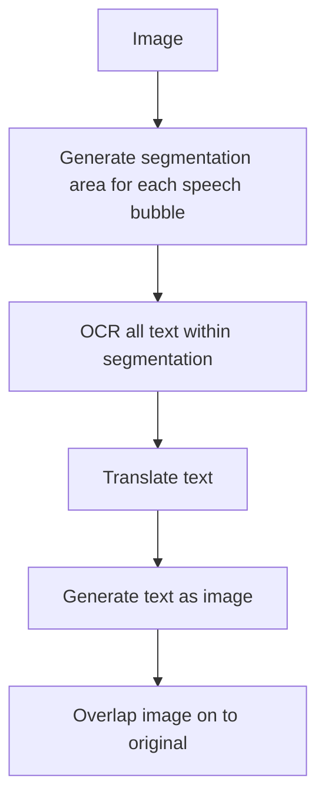

# Manga Translator

A manga translator that takes in images and translates the speech bubbles to english
<hr/>
## Installation

PaddleOCR requires python 3.9 or below. For this we are going to use conda to create an environment

```bash
git clone https://github.com/AksharDP/manga-translator.git
```

```bash
cd manga-translator
```

```bash
conda create -n "myenv" python=3.9.12
```

```bash
conda activate myenv
```

```bash
pip install paddlepaddle-gpu -i https://pypi.tuna.tsinghua.edu.cn/simple
```

```bash
pip install -r ./requirements.txt
```

```bash
python main.py
```
Put all the images that you would like to translate into the input folder that is created when you run the program the first time.

You can also change the language detection for PaddleOCR in config.ini




<br/>


<br/>


